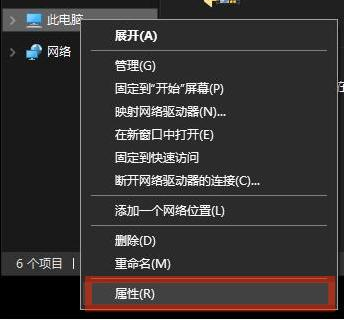
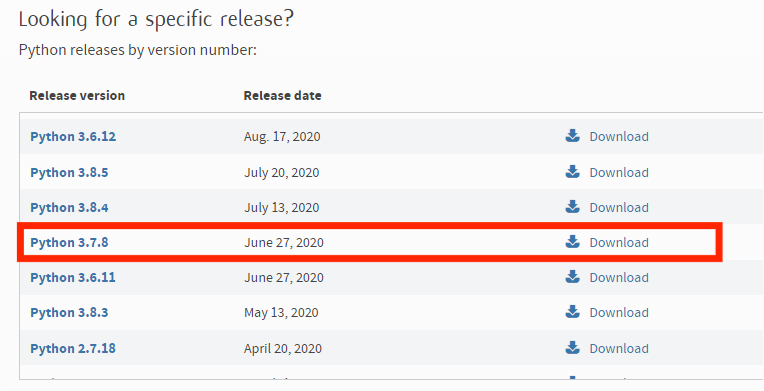
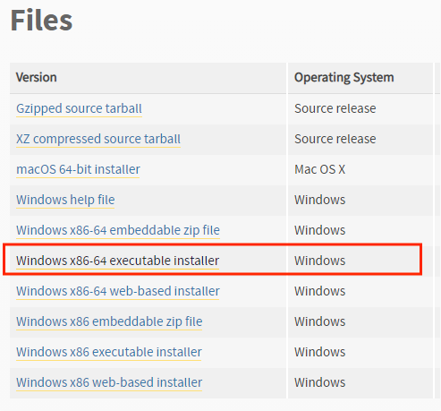

==================================
编程环境安装
==================================

Python 环境安装
---------------------

**环境：** Windows 10 64 位

1. 确认 Windows 10 系统为 64 位系统。首先右击此电脑，点击属性。

在系统类型一栏显示为 64位操作系统 为正常，如果显示 32位(x86)位操作系统，建议您更换 64位 windows 10 操作系统。

.. image:: ./images/about_computer.png

2. 步骤（1）： 从 `python 官网上 <https://www.python.org/downloads/>`_ 找到 3.7.8 的安装包，选择下载文件进行下载。

   步骤（2）：单击 ``Windows x86-64 executable installer`` 下载安装文件

.. warning:: 请确保下载的 `python.exe` 是64位的，python sdk适配3.6.6以上至3.8.9版本python版本，否则会影响python sdk的使用，切记。

3. 步骤（1）：确认安装包版本是 ``64-bit``, 否则会影响Python sdk使用。

   步骤（2）：勾选 ``Add Python 3.7 to Path``。

   步骤（3）：选择 ``Install Now`` 进行安装，如下图所示。

.. image:: ./images/win10_python_setup3.png

3. 安装完成后按 ``win+r`` 输入 ``cmd`` 打开命令提示符界面，在命令行里面输入 ``python -V``, 确认 Python 3.7.8 安装成功。

.. image:: ./images/win10_python_setup4.png

.. note:: cmd窗口会显示对应的版本信息，否则，请从第一步重新安装

VScode 环境安装
-------------------------

安装 VScode
++++++++++++++++++++++

**环境：** Windows 10 64 位

1.  从 `VScode 官网上 <https://code.visualstudio.com/Download/>`_ 找到 ``user installer 64位`` 的安装包，选择下载文件进行下载。

.. image:: ./images/win10_vscode_setup1.png

2.  步骤（1）：双击下载的安装包，勾选 ``我同意此协议`` 

    步骤（2）：单击 下一步

.. image:: ./images/win10_vscode_setup2.png

3. 步骤（1）：首先确认您的磁盘空间满足安装文件的要求，否则会安装失败
   
   步骤（2）：修改文件安装路径，建议您安装到除 C盘 以外的磁盘。

   步骤（3）：单击 下一步

.. image:: ./images/win10_vscode_setup3.png

4. 单击 下一步

.. image:: ./images/win10_vscode_setup4.png

4. 步骤（1）：勾选相关选项
   
   步骤（2）：单击 下一步

.. image:: ./images/win10_vscode_setup5.png

5. 单击 安装

.. image:: ./images/win10_vscode_setup6.png

6. 单击 完成

.. image:: ./images/win10_vscode_setup7.png

7. 出现如下画面，您的 VScode 安装成功

.. image:: ./images/win10_vscode_setup8.png

配置 VScode
+++++++++++++++++

1. 双击打开 VScode 软件，单击红色方框框选处。

.. image:: ./images/win10_config_vscode_setup1.png

2. 步骤（1）：在搜索框输入 ``chinese``
   
   步骤（2）：单击 Install

.. image:: ./images/win10_config_vscode_setup2.png

3. 单击 Restart

.. image:: ./images/win10_config_vscode_setup3.png

4. 重新启动后显示中文

.. image:: ./images/win10_config_vscode_setup4.png

5. 点击红色方框框选处。

.. image:: ./images/win10_config_vscode_setup1.png

6. 搜索框输入 ``python``，点击install

.. image:: ./images/win10_vscode_install_python.png

7. 配置完成

使用 VScode
++++++++++++++++++

1. 双击打开 VScode 软件，在上方菜单栏中点击 查看 按钮，单击 终端 选项。

.. image:: ./images/win10_use_vscode_setup1.png

2. 在终端内输入 ``python`` ，进入python环境。

.. image:: ./images/win10_use_vscode_setup2.png

更换 pip 源
-------------------------

在 python 里经常要安装各种这样的包，安装各种包时最常用的就是 pip，pip 默认从官网下载文件，官网位于国外，下载速度时快时慢，还经常断线，国内的体验并不太好。

解决办法是把 pip 源换成国内的，最常用的并且可信赖的源包括清华大学源、豆瓣源、阿里源。

永久修改
++++++++++++++++
1. 打开 VScode 后进入终端控制台，输入 

::

   pip config set global.index-url https://mirrors.aliyun.com/pypi/simple/
   pip install --upgrade pip
   
即可换源成功，然后我们输入:: 

   pip install opencv-python

即可完成opencv的安装。

临时修改
++++++++++++++++
1. 如果我们在安装某一个包的时候发现速度仍然很慢，可以使用临时修改的方法。 
:: 

   pip install opencv-python -i http://pypi.douban.com/simple/

其他的开源镜像站有:: 

   豆瓣：http://pypi.douban.com/simple/
   中科大：https://pypi.mirrors.ustc.edu.cn/simple/
   清华：https://pypi.tuna.tsinghua.edu.cn/simple/
   阿里云：https://mirrors.aliyun.com/pypi/simple/
